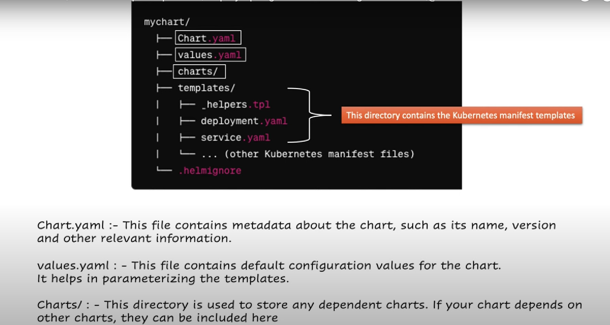

# Helm Chart Guide for a Spring Boot Application

## What is a Helm Chart?

Helm is a package manager for Kubernetes, similar to how Homebrew is used on macOS, Chocolatey on Windows, or APT on Ubuntu. It facilitates the process of managing Kubernetes applications by allowing users to define, install, and upgrade complex Kubernetes applications succinctly using a Helm Chart.

A Helm Chart is a collection of files organized in a specific directory structure, which describes a related set of Kubernetes resources. Charts can simplify the deployment and management of applications and services on a Kubernetes cluster, making it easier to define, version, and manage than manually handling complex `yaml` files.

## Why Use Helm Charts?

### Scenario Explaining the Relevance of Helm Charts

Consider a scenario where you need to deploy Jenkins on different operating systems like macOS, Windows, and Ubuntu. Each platform has its package manager that simplifies software installation. Similarly, for Kubernetes clusters, instead of manually configuring multiple complex YAML files for deployment, services, and management, you use a Helm chart. The Helm chart abstracts these details into a simple set of configurations that can be managed more intuitively.

### Challenges Addressed by Helm

Deploying applications on a Kubernetes cluster without Helm can present several challenges:

#### 1. Defining, Managing, and Executing Multiple Manifest Files
Without Helm, you have to manually handle multiple manifest files for different resources like deployments, services, and persistent volumes. It’s error-prone and inefficient.

#### 2. Deployment Ordering Challenge
The correct order of deployment is critical. For instance, a database must be ready before the app that uses it starts. Helm manages these dependencies effectively, ensuring resources are deployed in the correct sequence.

#### 3. Versioning and Rollbacks for All Resources
Helm tracks versions of your deployments and allows for easy rollbacks to a previous stable state, which is complex to manage manually with raw Kubernetes yaml files.

#### 4. Environment-Specific Configuration Files
Helm allows you to tweak your configurations to fit different environments (development, staging, production) without changing the core application logic. This separation of concerns simplifies management and enhances security.

## Helm Chart Directory Structure Overview

The structure of a Helm chart is designed to organize all necessary files in a coherent manner, facilitating easy management of Kubernetes resources. Below is an overview of the key components within a typical Helm chart directory:

- `Chart.yaml`: This file contains metadata about the chart such as its name, version, and other relevant information. It is essential for identifying the chart and its specifics.

- `values.yaml`: This file stores the default configuration values for the chart. These values can be overridden at installation time to customize the deployment according to specific requirements.

- `charts/`: This directory may contain any dependent charts. If your chart depends on other charts, they can be included here, enabling the management of complex applications with interdependencies.

- `templates/`: This is the core directory where Kubernetes manifest templates are stored. It typically includes files such as:
  - `deployment.yaml`: Defines the deployment configuration for the Kubernetes application.
  - `service.yaml`: Specifies the service that exposes the application.
  - `helpers.tpl`: Contains template helpers which can be reused across multiple manifest files, improving maintainability and reducing duplication.
  - Other manifest files as required by the application, such as `ingress.yaml`, `persistentVolumeClaim.yaml`, etc.

- `.helmignore`: Similar to `.gitignore`, this file specifies patterns to ignore when packaging the chart, which can be useful to exclude files and directories from the final chart package.

This structured approach not only makes the management of Kubernetes deployments easier but also ensures that complex applications can be handled with ease across different environments.

